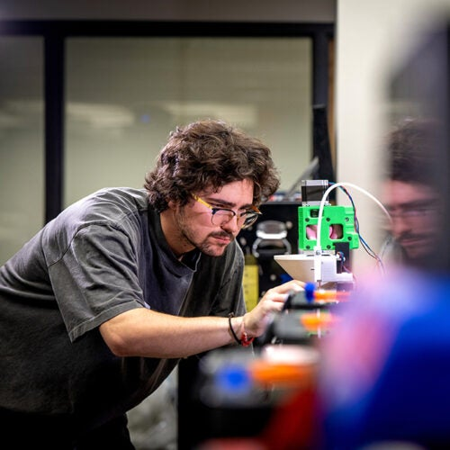
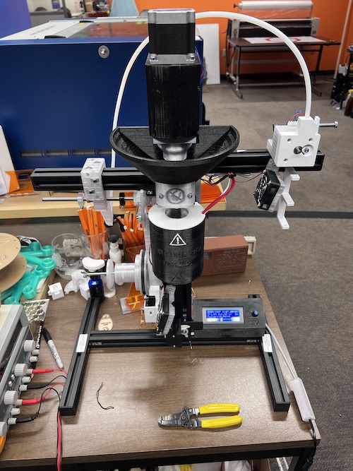
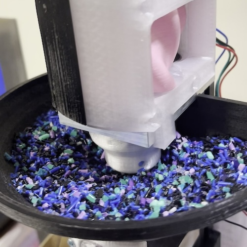
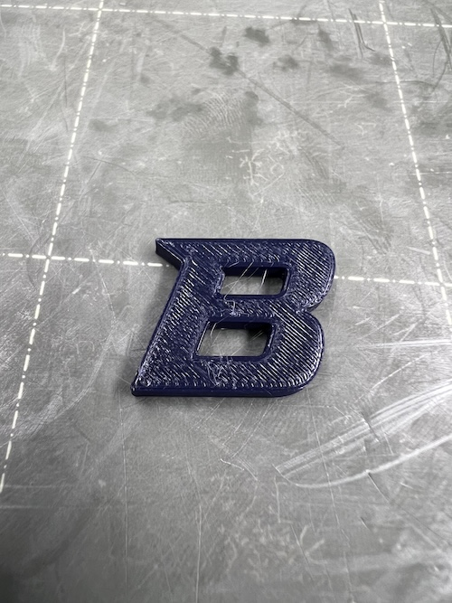
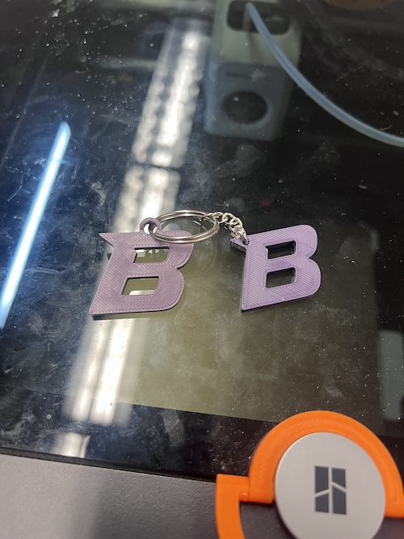
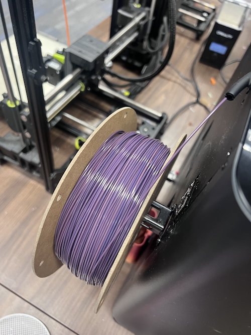

## Overview
In 2024 I began creating a new program for the Albertsons Library Makerlab. After I began working there in late 2023, I quickly realized that even a relatively small "print farm" produces a sizable amount of plastic waste from 3D printer usage alone. Things like failed prints, removed support structures, or simply prototype models almost always end up being discarded, and this marks the end of their lifespan. The Makerlab also spends a good portion of funds on 3D printer filament to continue supporting students' projects and aspirations, something recycling 3D printer waste would help supplement. After much effort, I successfully created a plastic recycling operation before my time at the Makerlab was over and the project is still ongoing today.

## Writeup
In the early months of 2024, I began researching options for creating an avenue for recycling plastic waste at the Makerlab. Days later I was encouraged to apply for a new grant from Boise State University, called the Sustainability Grant. The purpose of this grant was to fund students' endeavors in creating new sustainable practices for BSU. Initially I wanted to build my own machine from the ground up, but in the following weeks I was made aware of an open source project by the name of ARTME3D, which was ultimately going to be much easier to pitch to the board offering the sustainability grant. I wrote a new bill of materials and proposal document for submission and awaited a response. I learned about a week later that my proposal was accepted and I was awarded the full requested amount of funds for this project, and nearly three weeks later I had received the last of the materials I needed to begin working.

I successfully finished building the machine in July, and quickly began running some tests to make sure everything functioned properly and thankfully it seemed to work as expected. I then made my way to the Micron Center for Materials Research and requested access to a lab's plastic shredding machine. Coincidentally this machine happened to be built for the exact scenario I found myself in, and produced similarly sized granules of plastic from pieces as large as ~3 inches in diameter consistently. The only downsides to this machine were it's input size restriction of ~3 inches, meaning that any part larger than this must be cut or smashed in order to fit, and the time it took to produce the final product. It generally took me around an hour to shred about a kilogram of plastic with this machine. A sluggish pace, but acceptable for the early stages of this project.

Once I shredded about 2 kg of plastic, I travelled to the Engineering Innovation Studio where I was able to use a lab oven to dehydrate the shredded plastic. I considered skipping the dehydration process at first just to see if the machine would extrude the material, but I decided to go through with this step. For those who are unfamiliar with this process or with 3D printing in general, it is wise to keep your plastic as dry as possible. Using moist plastic in a 3D printer can result in a variety of undesirable artifacts on printed models and will also degrade the quality of recycled filament during the extrusion process. The shredded plastic was kept in a lab oven on a sheet of metal for ~5 hours at a temperature of 45°C, as it was all PLA. The melting point of plastic varies between types, so it is important to make sure you have just one kind of plastic during the entire recycling process. I used the following drying specifications during this project:

**PLA:** 40-50°C for 4-6 hours

**PETG:** 60-65°C for 6-8 hours

**ASA:** 70-80°C for 6-8 hours

The first test with the extruder was quite successful. I managed to get about 400g of usable filament from the first attempt. I hand picked the colors of scrap plastic in hoped that it would result in a nice blue or purple hue, and that particular mixture is featured in the photo above. The first thing I printed with the recycled filament was a Boise State "B" and it was rather small, about 1x1 inches, and printed on a Prusa MK3s. I was quite excited about how well my first 100% recycled plastic model printed! The photo below is that exact model:

From here I continued to refine the recycling process. The ARTME3D machine I was working with had a rather ingenious design, where gravity helped to keep the filament a consistent diameter instead of a traditional pulley system used in some other (much more expensive) machines. I tinkered with extrusion rates, pulling speeds, fan speeds, and winding speeds until I reached a point where I was getting relatively consistent results. However, I began to experience an issue with the gearbox which drives the machine's extrusion mechanism.

After running the machine for a combined total of just a few hours, one of the gears inside the gearbox began to slip which allowed the steel shaft to rotate independently from it. The stepper motor driving these gears was powerful enough, but the shaft was a completely flat cylinder and lacked a key to hold the gear in place. The solution for this was the sand the surface of the shaft and apply superglue in between it and the gear, but the glue wasn't enough to keep slippage from occurring. I tried reprinting the gear at different densities and with different inner diameters, to a point where I needed a machine to push the shaft into the printed gear, but the result was always eventually the same. The machine would run for a while but eventually that same gear would start to slip and ruin the batch. The solution was ultimately to add a key to the shaft, and this had to be done inside the Engineering Innovation Studio because we did not have a mill or lathe to create these metal parts. I had a key added to the shaft at the EIS, redesigned the gear to include a keyway, reprinted a new one in a stronger material, and assembled the gearbox once more. This did the trick and the machine was running once again.. for a few days.

A new issue presented itself! Now that the gear wasn't slipping, the torque from the extrusion process was transferred all the way up the auger, through the gearbox, and into the motor which ended up breaking the 3D printed enclosure. This required another redesign of the gearbox, and thankfully there was a new version up on the ARTME3D website. I downloaded this new model which was designed for the latest machine, and needed to make some adjustments for it to fit my older model correctly. I opened it up in my favorite CAD software, changed it to fit my machine, added some windows so I could see the gears rotating in case something went wrong again, printed the new model, then installed it on the machine and changed the motor configuration. Now the machine really was all set to continue running! I created a bit over 3 kg of recycled filament with this machine before the discussion of acquiring a more commercial grade setup arose.

With this first machine running and acting as a solid proof of concept, the Makerlab was looking for a more robust and reliable solution with the capability for much higher throughput. We settled on one, a proposal was written, and permission was granted to purchase this new equipment. We set it up quickly when it finally arrived and were very excited to get it running and produce more recycled filament, but quickly realized there would be some issues with this equipment. This new machine lacked the ability to make adjustments to extrusion rate, pulling speed, and winding speed based on the measured diameter of extruded plastic automatically, a feature we were keen on having as this removes the need to "babysit" the machine while it runs. The new equipment had manual controls for these parameters and also featured a kind of digital gauge which reported the diameter of the extruded filament to an Arduino. When connected to a computer with a bit of software from the manufacturer, the user can see a graph with these data points being plotted in real time. I realized this machine already had nearly everything it needed to make autonomous changes based on filament diameter, we just needed to purchase a few extra components and write some custom code.

I was told to pitch this to the Computer Engineering chair as a possible capstone project for a group of their students, which I thought was a great idea. I took the machine apart to inspect the internal components and took note of how it all worked, then put it back together. With a clear idea of what needed to be done to get this expensive piece of equipment to the next level, I wrote the proposal for this project which was soon delivered to the department chair. I included a background of the project, my idea for the upgrades to this new machine, how I expected it could be carried out, and a possible bill of materials. The project was accepted and an eager group of students began showing up at the Makerlab to get started on it.

Over the course of the next two semesters the students created some custom software, hardware, and made modifications to some of the existing components in order to complete the project. I am happy to report that as of early 2026 the machine's upgrades were complete, and it now churns out 100% recycled filament for use at the Makerlab. The next steps are to obtain a shredder and lab oven, then the Makerlab will have the ability to recycle many different types of plastic into usable 3D printer filament while keeping the entire process on site!

